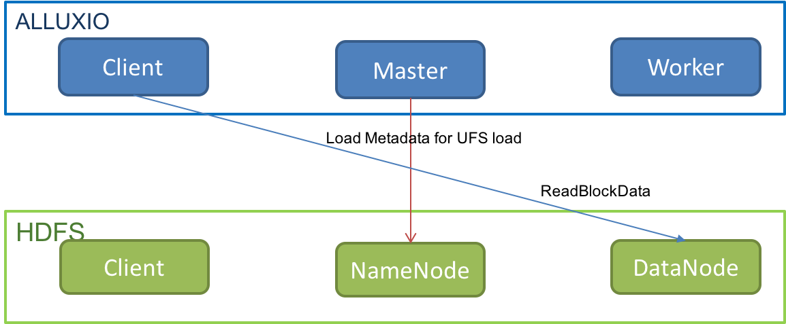
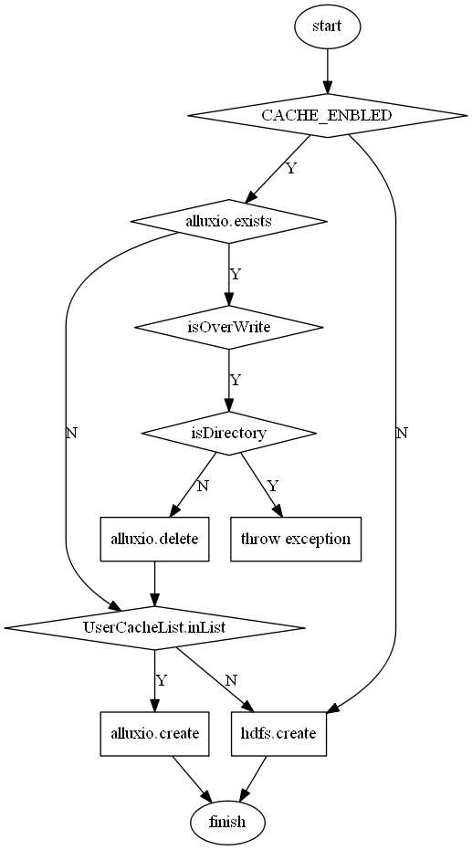

# Alluxio作为路由和缓存功能的设计文档

## 功能要求和意义

1. 利用Alluxio的Unified Namespace功能去做多HDFS集群的统一入口；替代HDFS Federation + ViewFS的方案，与其区别在于，Alluxio的mountTable是在server端，便于管理和维护；
2. 在路由的功能之上，对热数据进行缓存，从而对计算进行加速；
3. 将临时的，可以不保存的路径直接放在Alluxio Space，从而减少namenode的元数据的频繁的增加和删除；解决Heap的频繁分配和删除的GC问题；

## 存在的问题

Alluxio社区是处理多HDFS集群的架构图如下图所示：


从社区的架构图中可知，针对我们的应用场景，主要存在如下的功能不足：

1. 多HDFS的集群的元数据信息都会进入Alluxio中；
2. Alluxio的元数据存储能力；通过测试可知，512M的Memory仅可以存放100,000个路径信息和1000,000个文件信息；在实际使用时加上block的元数据信息，实际存放的数量会进一步减小；
3. Alluxio不支持Append操作，也不支持Through到UFS的Append操作；在我们的使用场景中，Flume是调用了HDFS的append接口；
4. Alluxio不支持对部分路径做WriteType(MUST_CACHE)的设置；


## 方案设计

方案设计主要分为路由功能，路由加缓存功能；整体的功能设计架构图如下：


从架构图中可以看出，可知: 需要实现的主要功能有Proxy功能和切断Alluxio和HDFS的联接`Load Metadata from UFS`；

### 路由功能

通过参数`MODE_ROUTE_ENABLED`控制Alluxio是否开启路由功能；

在开启路由的之后，HDFS的请求都会到Proxy中，在Alluxio中根据MountTable信息对请求进行转发，将请求转发给<font color = blue>其中一个</font>相应的HDFS(Cluster1 或 Cluster2)；

### 缓存功能

通过参数`MODE_CACHE_ENABLED`控制Alluxio是否开启缓存功能；

在开启路由和缓存功能之后，HDFS的请求都会到Proxy中，在写的时候，Proxy会根据是否写Cache，对请求进行处理和转发；将请求转发给<font color = blue>Alluxio或HDFS(Cluster1, cluster2)中一个</font>；

在读的时候，Proxy会先去Alluxio Space中去获取File的信息，如果获取不到，则会去UFs中获取信息；

## 实现的功能

### listMountPoint

为了方便对多HDFS集群的管理，实现ListMountPoint功能，查看当前Alluxio挂载了那些HDFS的目录；

Alluxio不提供Client去Master拿取MountPoint信息的RPC接口；

1. 需要实现这个接口；

接口的thrift定义如下，

```thrift
struct MountPairInfo{
  1: string alluxioPath
  2: string ufsPath
}

/**
  * Returns the mount pair info of diectory
  */
  MountPairInfo getMountPointWithPath(
    /** the path of the directory*/ 1: string path
  )throws(1: exception.AlluxioTException e)
/**
  *get All Mount Point
  */
  list<MountPairInfo> getMountPoint(
  )throws(1:exception.AlluxioTException e)
```

具体RPC代码的设计实现参考代码；

2. 需要实现shell的功能去查看MountPoint信息`alluxio fs listMountPoint`;

具体的代码实现参看`shell/command/ListMountPoint.java`;

### UserMustCacheList

**场景需求**：有部分数据只想缓存在Alluxio Space中，从而减轻HDFS namenode的压力；此类数据包括：

1. 在MR（hive）计算过程中，hive的中间数据，比如说Jar，job.xml这类文件放到Alluxio Space中，因为Alluxio Master加的锁的颗粒度较细，从而能够提高并发度；
2. 存储有一定时期限制的，同时此类数据是可以丢失的；比如说MR和Spark的History log（在集群数量较大的时候，此类文件的文件数量很大），可以只放进Alluxio的space中；
   1. 减轻了对UFS的压力，包括namenode的Memory压力，和namenode的GC压力；因为频繁的创建文件和删除文件，造成一定的Memory碎片问题，在CMS中，如果触发Full GC，延迟将会是很高的（因为在较大的集群中，namenode的内存一般都是较大的，当前我们的内存是80GB（600 datanodes）；
   2. 因为当前Alluxio Space中文件的没有副本，所以这种不能使用于需要持久化的数据；


Alluxio社区不支持设置特定的目录只做Cache；为了此参数可以灵活配置，将此参数设计为client的参数，功能的实现也是放在client；

1. 给社区的版本实现此功能，功能已经实现并提交PR：https://github.com/Alluxio/alluxio/pull/5413；


2. 在我们的使用场景中，将此功能在Proxy层实现；具体实现祥见Proxy层的API设计和实现；

### delete Alluxio Only

为社区的版本增加`alluxio fs rm -deleteAlluxioOnly` 的shell功能，并提交PR：https://github.com/Alluxio/alluxio/pull/5412；

### Alluxio 与UFS的分离

Alluxio的各个组件与HDFS的各个组件的交互如下图所示：


从图中可知，在4中情况下，Alluxio会与HDFS产生交互：

1. Alluxio Master去HDFS namenode load metadata;
2. 在write的时候，在不启用worker作为代理的时候，Alluxio client会与HDFS的client产生交互；
3. 在write的时候，启用worker作为代理的时候，worker会与HDFS的client产生交互；
4. 在read的时候，Alluxio client会与HDFS datanode交互；

针对上面存在的四种交互的分离，具体设计和实现如下：

1. 在Alluxio的master端添加`alluxio.master.load.metadata.from.ufs.enable(default: fale)`, 具体代码的实现参考`master/file/FileSystemMaster.java`; 在我们的应用场景中，此参数应该设置为`true`;
   1. NOTE：在元数据分离的情况下，如果是通过HDFS load到Alluxio Space中的数据，Alluxio的元数据信息，应当包含UFS path的信息；(这个信息的保留在read data的时候会用到)
   2. 在我们的实际使用场景中，Alluxio Space中的数据都是通过create with WriteType.MUST_CACHE， 所以在写Alluxio Space的时候，数据不会写到 HDFS Space中去；
2. 将参数`alluxio.user.ufs.delegation.enabled(default: true)` 设置为true的时候，这个交互就不会发生；
3. 在我们的使用场景中，不会发生这个情况，我们的writeType都是Must_Cache;
4. 这种交互不需要断开的；

**Alluxio与UFS分离后的交互图**



### Load

load功能是指将UFS中的数据load到Alluxio的space中；


### Proxy

Proxy的功能主要：

1. 解析功能：根据path信息去解析获取HDFS的Client和HDFS Space的path信息；
2. 接口实现：实现兼容HDFS client的API接口；
3. load功能： 将UFS中的数据从HDFS中load进Alluxio Space中；

#### 解析功能

解析功能的时序图如下图所示：


通过解析功能，可以获取当前path的`HdfsInfo (Paht, org.apache.hadoop.fs.FileSystem)`

NOTE: 在具体的实际实现中，在Proxy端对MountPoint的信息和`FileSystem`信息进行了缓存，提高性能；

#### API 实现

Proxy层实现了API有：Append；

##### Append


##### Create



##### mkdirs


##### open


##### rename


rename目前支持两种情况：

1. 文件都在UserMustCacheList中；
2. 文件的UFS scheme必须一致；

##### get


##### set


